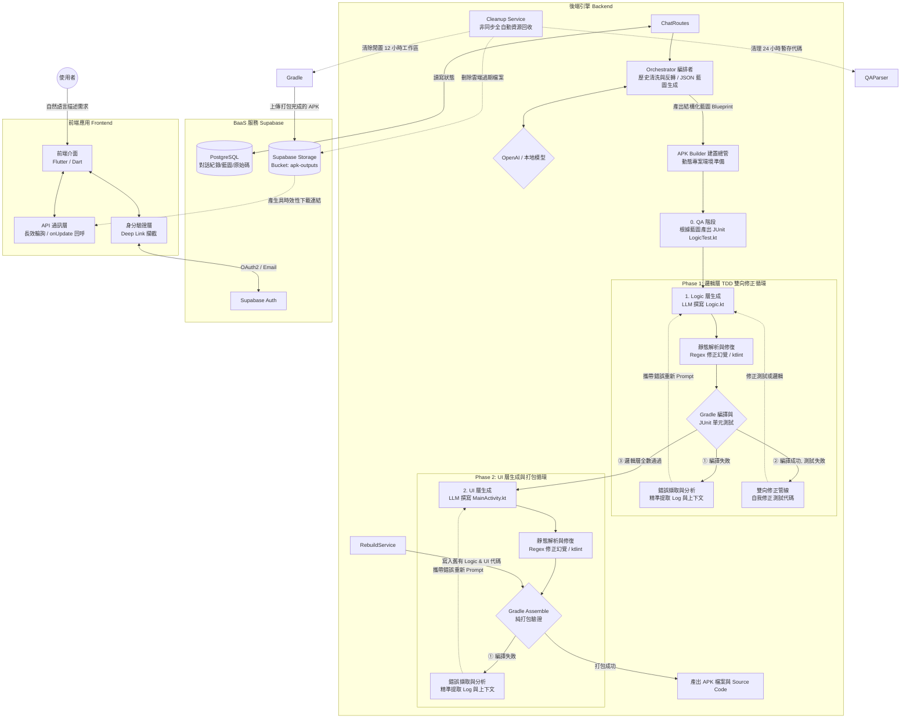

# 系統架構圖

```mermaid
graph TD
    %% 使用者層
    User((使用者)) -->|自然語言描述需求| FlutterUI[前端介面<br>Flutter / Dart]

    %% 前端應用
    subgraph Frontend [前端應用 Frontend]
        FlutterUI
        API_Layer[API 通訊層<br>長效輪詢 / onUpdate 回呼]
        Auth_Layer[身分驗證層<br>Deep Link 攔截]
        
        FlutterUI <--> API_Layer
        FlutterUI <--> Auth_Layer
    end

	%% === 後端核心系統 ===
    subgraph Backend [後端引擎 Backend]
        
        ChatRoutes --> Orchestrator[Orchestrator 編排者<br>歷史清洗與反轉 / JSON 藍圖生成]
        Orchestrator <--> LLM_Orch{OpenAI / 本地模型}
        
        Orchestrator -->|產出結構化藍圖 Blueprint| APKBuilder[APK Builder 建置總管<br>動態專案環境準備]

        %% QA 測試生成階段
        APKBuilder --> Step0_QA[0. QA 階段<br>根據藍圖產出 JUnit LogicTest.kt]
        
        %% === Phase 1: 邏輯層 ===
        subgraph Phase1 [Phase 1: 邏輯層 TDD 雙向修正循環]
            direction TB
            Logic_LLM[1. Logic 層生成<br>LLM 撰寫 Logic.kt]
            Logic_Parser[靜態解析與修復<br>Regex 修正幻覺 / ktlint]
            Logic_Test{Gradle 編譯與<br>JUnit 單元測試}
            Logic_ErrorExt[錯誤擷取與分析<br>精準提取 Log 與上下文]
            Logic_FixTest[雙向修正管線<br>自我修正測試代碼]
            
            Logic_LLM --> Logic_Parser --> Logic_Test
            Logic_Test --"① 編譯失敗"--> Logic_ErrorExt -.->|攜帶錯誤重新 Prompt| Logic_LLM
            Logic_Test --"② 編譯成功, 測試失敗"--> Logic_FixTest -.->|修正測試或邏輯| Logic_LLM
        end
        
        Step0_QA --> Logic_LLM

        %% === Phase 2: UI 層 ===
        subgraph Phase2 [Phase 2: UI 層生成與打包循環]
            direction TB
            UI_LLM[2. UI 層生成<br>LLM 撰寫 MainActivity.kt]
            UI_Parser[靜態解析與修復<br>Regex 修正幻覺 / ktlint]
            UI_Build{Gradle Assemble<br>純打包驗證}
            UI_ErrorExt[錯誤擷取與分析<br>精準提取 Log 與上下文]
            
            UI_LLM --> UI_Parser --> UI_Build
            UI_Build --"① 編譯失敗"--> UI_ErrorExt -.->|攜帶錯誤重新 Prompt| UI_LLM
        end
        
        Logic_Test --"③ 邏輯層全數通過"--> UI_LLM
        RebuildService -->|寫入舊有 Logic & UI 代碼| UI_Build
        
        UI_Build --"打包成功"--> APK_Output[產出 APK 檔案與 Source Code]
        
        GC[Cleanup Service<br>非同步全自動資源回收]
    end

    %% Supabase 服務
    Auth_Layer <-->|OAuth2 / Email| Auth[Supabase Auth]
    
    subgraph BaaS [BaaS 服務 Supabase]
        Auth
        DB[(PostgreSQL<br>對話紀錄/藍圖/原始碼)]
        Storage[(Supabase Storage<br>Bucket: apk-outputs)]
    end

    %% 跨層資料流動
    ChatRoutes <-->|讀寫狀態| DB
    Gradle -->|上傳打包完成的 APK| Storage
    Storage -.->|產生具時效性下載連結| API_Layer
    
    %% 回收機制作用範圍
    GC -.->|刪除雲端過期檔案| Storage
    GC -.->|清除閒置 12 小時工作區| Gradle
    GC -.->|清理 24 小時暫存代碼| QAParser
```
