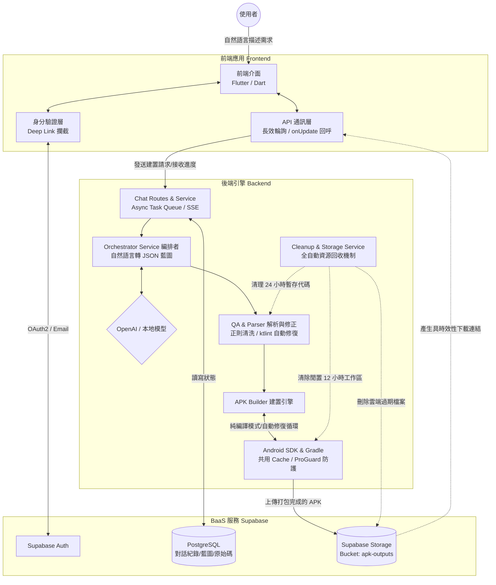

# 系統架構圖

```mermaid
graph TD
    %% 使用者層
    User((使用者)) -->|自然語言描述需求| FlutterUI[前端介面<br>Flutter / Dart]

    %% 前端應用
    subgraph Frontend [前端應用 Frontend]
        FlutterUI
        API_Layer[API 通訊層<br>長效輪詢 / onUpdate 回呼]
        Auth_Layer[身分驗證層<br>Deep Link 攔截]
        
        FlutterUI <--> API_Layer
        FlutterUI <--> Auth_Layer
    end

    %% 後端引擎
    API_Layer -->|發送建置請求/接收進度| ChatRoutes[Chat Routes & Service<br>Async Task Queue / SSE]
    
    subgraph Backend [後端引擎 Backend]
        ChatRoutes --> Orchestrator[Orchestrator Service 編排者<br>自然語言轉 JSON 藍圖]
        Orchestrator <--> LLM{OpenAI / 本地模型}
        Orchestrator --> QAParser[QA & Parser 解析與修正<br>正則清洗 / ktlint 自動修復]
        QAParser --> Builder[APK Builder 建置引擎]
        
        Builder <-->|純編譯模式/自動修復循環| Gradle[Android SDK & Gradle<br>共用 Cache / ProGuard 防護]
        
        GC[Cleanup & Storage Service<br>全自動資源回收機制]
    end

    %% Supabase 服務
    Auth_Layer <-->|OAuth2 / Email| Auth[Supabase Auth]
    
    subgraph BaaS [BaaS 服務 Supabase]
        Auth
        DB[(PostgreSQL<br>對話紀錄/藍圖/原始碼)]
        Storage[(Supabase Storage<br>Bucket: apk-outputs)]
    end

    %% 跨層資料流動
    ChatRoutes <-->|讀寫狀態| DB
    Gradle -->|上傳打包完成的 APK| Storage
    Storage -.->|產生具時效性下載連結| API_Layer
    
    %% 回收機制作用範圍
    GC -.->|刪除雲端過期檔案| Storage
    GC -.->|清除閒置 12 小時工作區| Gradle
    GC -.->|清理 24 小時暫存代碼| QAParser
```
