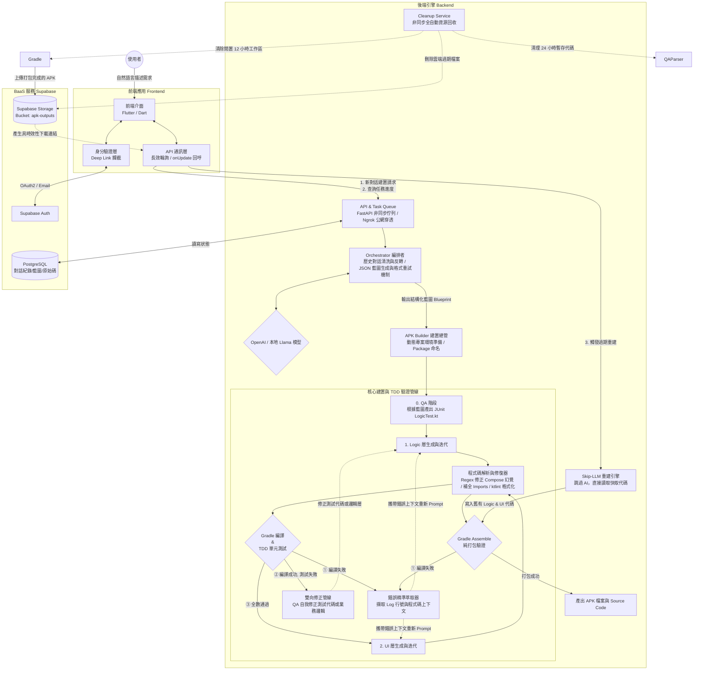

# 系統架構圖

```mermaid
graph TD
    %% 使用者層
    User((使用者)) -->|自然語言描述需求| FlutterUI[前端介面<br>Flutter / Dart]

    %% 前端應用
    subgraph Frontend [前端應用 Frontend]
        FlutterUI
        API_Layer[API 通訊層<br>長效輪詢 / onUpdate 回呼]
        Auth_Layer[身分驗證層<br>Deep Link 攔截]
        
        FlutterUI <--> API_Layer
        FlutterUI <--> Auth_Layer
    end

	%% === 後端 API 與任務路由 ===
    API_Layer -->|1. 新對話建置請求<br>2. 查詢任務進度| ChatRoutes[API & Task Queue<br>FastAPI 非同步佇列 / Ngrok 公網穿透]
    API_Layer -->|3. 觸發過期重建| RebuildService[Skip-LLM 重建引擎<br>跳過 AI，直接讀取快取代碼]

    %% === 後端核心系統 ===
    subgraph Backend [後端引擎 Backend]
        
        %% 編排層
        ChatRoutes --> Orchestrator[Orchestrator 編排者<br>歷史對話清洗與反轉 / JSON 藍圖生成與格式重試機制]
        Orchestrator <--> LLM{OpenAI / 本地 Llama 模型}
        
        Orchestrator -->|輸出結構化藍圖 Blueprint| APKBuilder[APK Builder 建置總管<br>動態專案環境準備 / Package 命名]

        %% 核心建置與 TDD 驗證管線
        subgraph BuilderPipeline [核心建置與 TDD 驗證管線 ]
            direction TB
            
            Step0_QA[0. QA 階段<br>根據藍圖產出 JUnit LogicTest.kt]
            
            Step1_Logic[1. Logic 層生成與迭代]
            Step1_Parser[程式碼解析與修復器<br>Regex 修正 Compose 幻覺 / 補全 Imports / ktlint 格式化]
            Step1_Test{Gradle 編譯<br>&<br>TDD 單元測試}
            
            Step1_ErrorExt[錯誤精準萃取器<br>擷取 Log 行號與程式碼上下文]
            Step1_FixTest[雙向修正管線<br>QA 自我修正測試代碼或業務邏輯]
            
            Step2_UI[2. UI 層生成與迭代]
            Step2_Build{Gradle Assemble<br>純打包驗證}
            
            %% 邏輯層循環
            Step0_QA --> Step1_Logic
            Step1_Logic --> Step1_Parser --> Step1_Test
            
            Step1_Test --"① 編譯失敗"--> Step1_ErrorExt -.->|攜帶錯誤上下文重新 Prompt| Step1_Logic
            Step1_Test --"② 編譯成功, 測試失敗"--> Step1_FixTest -.->|修正測試代碼或邏輯層| Step1_Logic
            
            %% UI 層循環
            Step1_Test --"③ 全數通過"--> Step2_UI
            Step2_UI --> Step1_Parser --> Step2_Build
            Step2_Build --"① 編譯失敗"--> Step1_ErrorExt -.->|攜帶錯誤上下文重新 Prompt| Step2_UI
        end
        
        APKBuilder --> Step0_QA
        RebuildService -->|寫入舊有 Logic & UI 代碼| Step2_Build
        
        Step2_Build --"打包成功"--> APK_Output[產出 APK 檔案與 Source Code]
        
        GC[Cleanup Service<br>非同步全自動資源回收]
    end

    %% Supabase 服務
    Auth_Layer <-->|OAuth2 / Email| Auth[Supabase Auth]
    
    subgraph BaaS [BaaS 服務 Supabase]
        Auth
        DB[(PostgreSQL<br>對話紀錄/藍圖/原始碼)]
        Storage[(Supabase Storage<br>Bucket: apk-outputs)]
    end

    %% 跨層資料流動
    ChatRoutes <-->|讀寫狀態| DB
    Gradle -->|上傳打包完成的 APK| Storage
    Storage -.->|產生具時效性下載連結| API_Layer
    
    %% 回收機制作用範圍
    GC -.->|刪除雲端過期檔案| Storage
    GC -.->|清除閒置 12 小時工作區| Gradle
    GC -.->|清理 24 小時暫存代碼| QAParser
```
