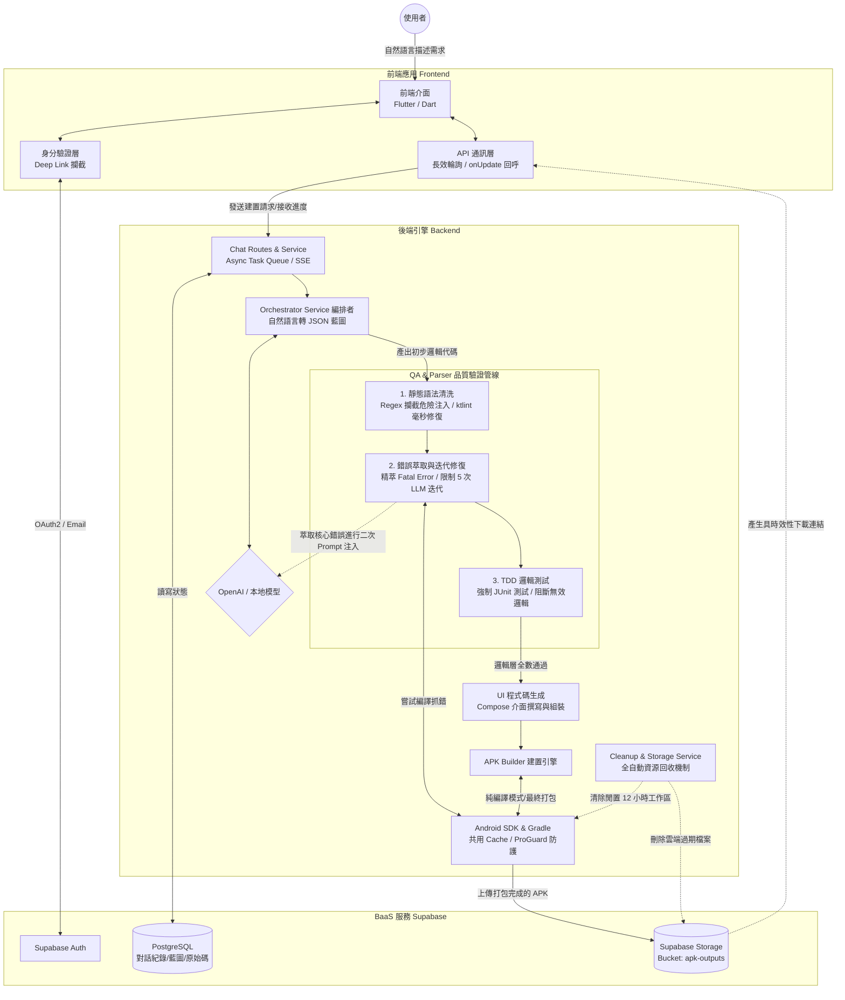

# 零門檻 APK 自動建置系統 (Zero-Threshold APK Builder)

**備註：** 由於專題目前尚未正式發表，原始碼暫時設為私有。如需技術交流或查看 Demo，歡迎聯繫 `paulag3seconds@gmail.com`。

## 專案定位

這是一款對話式 Android APK 自動建置工具。使用者只需透過自然語言描述應用程式需求，系統便會自動進行需求分析、生成藍圖、撰寫 Kotlin 程式碼、執行自動修復與測試，並最終編譯打包成可下載的 APK 檔案。

## 系統架構圖

## 系統架構與技術棧 (Tech Stack)

本專案採用前後端分離架構，結合 LLM 人工智慧生成技術與 Android 原生建置工具鏈。

### 前端應用 (Frontend)

- **核心框架**：Flutter (3.10+) / Dart
- **架構設計**：採用 StatefulWidget 與 Service-based 邏輯分離，確保 UI 與業務邏輯解耦。
- **狀態與非同步處理**：實作長效輪詢 (Long-polling) 與 `onUpdate` 回呼機制，避免阻塞 UI 線程，即時反映後端建置狀態。
- **第三方整合**：
  - `supabase_flutter`：處理使用者身分驗證 (OAuth2 / Email) 與資料庫即時互動。
  - `app_links` & `windows_single_instance`：支援 Deep Link 攔截與 Windows 單例應用特性。
  - `http` & `url_launcher`：負責 RESTful API 通訊與外部連結（如 APK 下載）跳轉。

### 後端引擎 (Backend)

- **核心框架**：Python 3.10+ / FastAPI
- **非同步與併發處理**：
  - 透過 `asyncio` 實作非同步任務引擎，並**支援多使用者並行請求 (Concurrency)**。每個建置任務會被放入獨立的 Task Queue，並透過 UUID 追蹤進度，打破傳統單一 Queue 的阻塞瓶頸。
- **LLM 整合**：使用 `Gemma 4 26B A4B` 本地模型，負責系統核心的「自然語言轉藍圖」及「程式碼生成」。
- **自動化建置工具**：
  - **Android SDK** & **Gradle**：動態建立專案並執行 APK 編譯。特別配置了 **共用 Gradle Cache (`GRADLE_USER_HOME`)**，避免每個專案重複下載肥大的依賴檔案，大幅提升編譯速度與節省伺服器 (Docker) 磁碟空間。
  - **ktlint**：整合 Kotlin 代碼格式化與語法自動修復。

### 資料庫與後端即時服務 (BaaS)

- **平台**：Supabase (底層為 PostgreSQL + Supabase Storage)
- **功能應用**：
  - 儲存對話歷史、專案藍圖 (AppBlueprint) 與生成的原始碼。
    
    
  - **雲端檔案託管**：建置完成的 APK 會自動上傳至 **Supabase Storage** (`apk-outputs` Bucket)，並產生具時效性的安全下載連結供前端存取。
  - 負責統一的使用者身分驗證 (Auth)。

---

## 資訊安全與空間維護 (Security & Stability)

為了確保系統從開發階段到生產環境的安全性與伺服器穩定性，本系統實作了以下防護與空間最佳化機制：

1. **全自動資源回收機制 (Garbage Collector)**：
   - **雲端過期清理**：定期掃描 Supabase 資料庫，當發現對話紀錄中的 APK 下載連結已過期或是該專案(對話)已經刪除，系統會自動呼叫 Storage API 刪除雲端檔案，節省雲端空間。
   - **本地工作區釋放**：監控本地端 Gradle 工作目錄 (`WORKSPACES_DIR`)。若專案閒置超過 **12 小時**，清道夫服務會自動移除該專案的編譯目錄，防止伺服器硬碟被大量 Gradle Build 檔案塞滿。
   - **暫存原始碼清理**：定期清理 `STATIC_DIR` 中存放超過 **24 小時**的 `.kt` 暫存原始碼。
2. **環境變數與金鑰隔離**：
   - 嚴格分離前端與後端權限。後端透過 `python-dotenv` 載入具備最高權限的 `SUPABASE_SERVICE_ROLE_KEY` 進行資料處理與管理。

---

## 核心運作邏輯與模組分工 (Module Division)

### 後端 (Backend)

- **Chat Routes & Service**：負責接收多併發請求，利用 Async Queue 派發任務，並透過 SSE/WebSocket 即時回傳進度 (`[DONE]`, `[ERROR]`)。
- **Orchestrator Service (編排者)**：將自然語言轉化為結構化 JSON 藍圖。
- **QA & Parser (解析與修正)**：實作 `ktlint` 與正規表達式，自動提取程式碼並修復錯誤，同時產生 JUnit 測試代碼 (TDD 流程)。
- **APK Builder (建置引擎)**：驅動整體生成流程（初始化 -> 編譯循環 -> 產出 APK）。並支援 **純編譯模式**，可直接從資料庫載入既有代碼跳過 LLM 階段。
- **Cleanup & Storage Service**：負責本機與雲端的雙重檔案生命週期管理，維持系統長效運作。

### 前端 (Frontend)

- **API 通訊層**：封裝後端請求，管理「啟動任務」與負責背景狀態追蹤。
- **動態 UI 更新**：透過高可靠性輪詢/SSE機制，即時更新 `ChatHistory` 列表，當偵測到 Supabase Storage 的 APK 下載連結後，動態渲染出下載按鈕提供存取。
